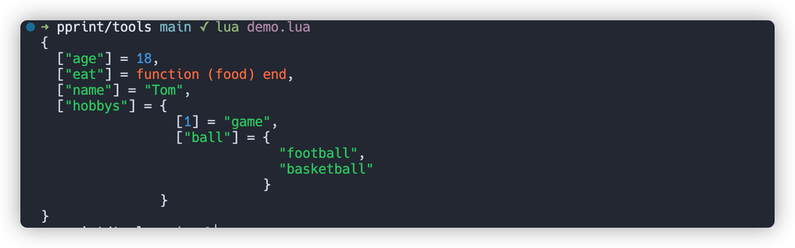

A lua library completes data beautification output, and has no external dependencies.

# Require

**Install**

You can install the library with _luarock_, like this:

```bash
$ luarocks install pprint
```

Or the file should dropped into a project or a lua lib, then require by it:

```lua
pprint = require('pprint')
```

# Usage

Also, using the library is very simple. It provides several functions:

- `pprint.pprint(obj, indent?, width?, depth?)`

  Print the formatted representation of object with color to stream with a trailing newline.

  _indent_: indent of each level

  _width_: max col limit

  _depth_: level limit of recursive

  ```lua
  local test_struct = {
      ['name'] = 'Tom',
      age = 18,
      hobbys = {
          'game',
          ['ball'] = {'football', 'basketball'}
      },
      eat = function(food)
          print('I eat: ' .. food)
      end
  }
  pprint.pprint(test_struct)
  ```

  

- `pprint.pp(obj, args?)`

  Print the formatted representation of object to stream with a trailing newline.

  _args_: The options of function. Will be transparently transmitted to `PrettyPrinter`.

- `pprint.pformat(obj, indent?, width?, depth?)`

  Return the formatted representation of object as a string.

  _indent_: Number of spaces to indent for each level of nesting.

  _width_: Attempted maximum number of columns in the output.

  _depth_: Depth limit, exceeding the limit will be folded.

- `pprint.isrecursive(obj)`

  Determines whether object requires recursive representation.

  ```lua
  pprint.isrecursive(1) -- false
  pprint.isrecursive({1, 2, 3}) -- true
  ```

- `pprint.isreadable(obj)`

  Determines whether the formatted representation of object is "readable" that can be used to reconstruct the object's value via `load()`.

  ```lua
  pprint.isreadable(1) -- true
  pprint.isreadable({1, 2, 3}) -- true
  pprint.isreadable({
            'tom',
            28,
            say = function ()
                print('hello')
            end
          }) -- false
  ```

# Source

The _pprint_ library define a class:
`pprint.PrettyPrinter(args)`

```lua
-- Create a `PrettyPrinter` instance.
local pp = pprint.PrettyPrinter({...})
```

The _args_ support some arguments:

- `args.indent`: integer, Number of spaces to indent for each level of nesting.
- `args.width`: integer, Attempted maximum number of columns in the output.
- `args.depth`: integer, Depth limit, exceeding the limit will be folded.
- `args:compact`: boolean, If true, several items will be combined in one line.
- `args:sort_tables`: boolean, If true, sort the table by key.
- `args.scientific_notation`: boolean, If true, will display number with scientific notation.
- `args.color`: boolean, If true, will format with color escape.

The _function_ provided:

- `PrettyPrinter:pprint(obj)`
- `PrettyPrinter:pformat(obj)`
- `PrettyPrinter:isrecursive(obj)`
- `PrettyPrinter:isreadable(obj)`

# Feature

- Pure lua implementation, no external lib dependencies.
- Support color output.
- Work with lua >=5.2
